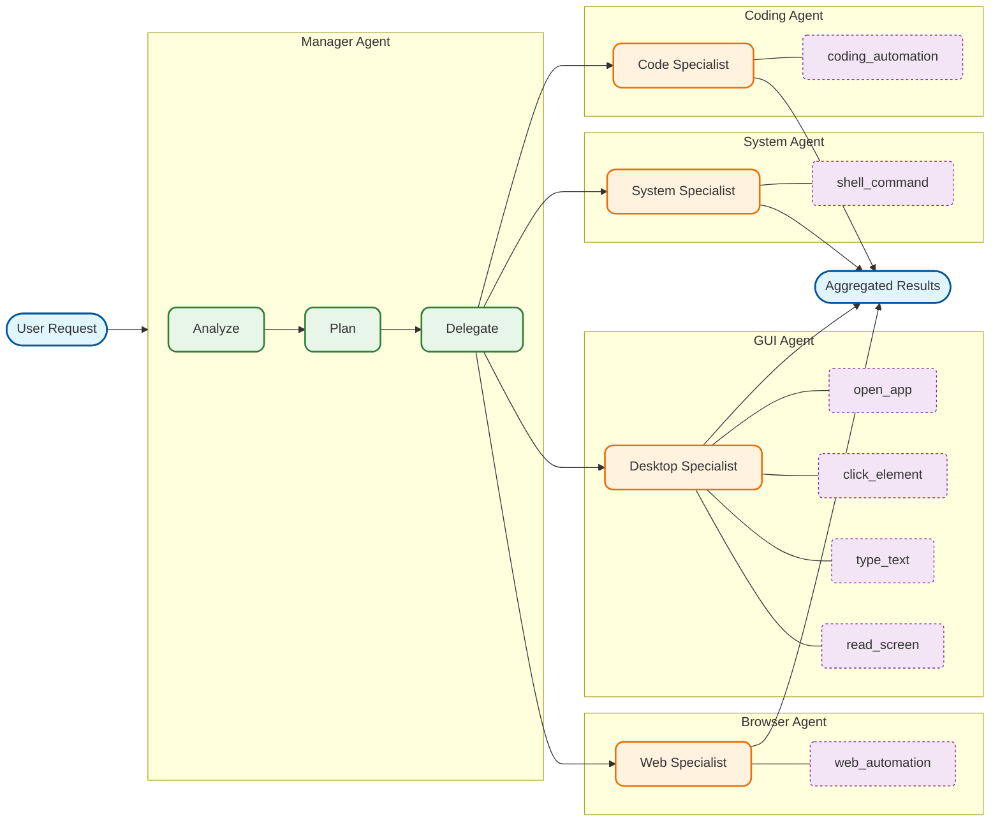

# Computer Use Agent

Cross-platform AI agent system for autonomous desktop and web automation.

[](https://www.python.org/downloads/)
[](https://opensource.org/licenses/MIT)
[](https://www.crewai.com/)
[](https://browser-use.com/)

## Overview

Computer Use Agent enables AI to control your computer like a human would. Describe what you want in natural language, and the system figures out how to do it — across browsers, desktop apps, and the terminal.

**Key capabilities:**

- **Multi-agent orchestration** — Manager agent decomposes tasks and delegates to specialists
- **Browser automation** — Web navigation, downloads, forms, phone verification via Browser-Use
- **Desktop GUI automation** — Control any application with multi-tier accuracy (accessibility APIs → OCR → vision AI)
- **System commands** — Safe shell execution with validation and confirmation prompts
- **Code automation** — Write, refactor, and debug code via Cline AI integration
- **Voice input** — Optional speech-to-text via Deepgram (100+ languages)
- **Phone verification** — Optional Twilio SMS integration for account signups

## How It Works



1. **Manager Agent** receives your request and breaks it into subtasks
2. **Specialist agents** execute their portion using appropriate tools
3. **Context flows automatically** between agents (file paths, data, state)
4. **Multi-tier accuracy** ensures reliable element detection across platforms

For detailed architecture, see [docs/ARCHITECTURE_OVERVIEW.md](docs/ARCHITECTURE_OVERVIEW.md) and [docs/CREWAI_ARCHITECTURE.md](docs/CREWAI_ARCHITECTURE.md).

## Agents

| Agent       | Role                                  | Description                                                                |
| ----------- | ------------------------------------- | -------------------------------------------------------------------------- |
| **Manager** | Task Orchestration Manager            | Analyzes requests, decomposes into subtasks, delegates to specialists      |
| **Browser** | Web Automation Specialist             | Web navigation, downloads, forms, phone verification via Browser-Use       |
| **GUI**     | Desktop Application Automation Expert | Native app control with multi-tier accuracy (accessibility → OCR → vision) |
| **System**  | System Command & Terminal Expert      | Shell commands, file operations, process management                        |
| **Coding**  | Code Automation Specialist            | Code writing, refactoring, bug fixes via Cline AI                          |

## Tools

### GUI Tools

| Tool                      | Description                                        |
| ------------------------- | -------------------------------------------------- |
| `open_application`        | Launch and focus desktop applications              |
| `get_accessible_elements` | Get interactive UI elements via accessibility APIs |
| `click_element`           | Click elements using multi-tier detection          |
| `type_text`               | Keyboard input, shortcuts, and text entry          |
| `read_screen_text`        | Extract text from screen via OCR                   |
| `scroll`                  | Scroll content in applications                     |
| `get_window_image`        | Capture specific window as image                   |
| `check_app_running`       | Check if an application is running                 |
| `list_running_apps`       | List all running applications                      |
| `request_human_input`     | Escalate to human for CAPTCHAs, 2FA, or decisions  |

### Web Tools

| Tool             | Description                                                                          |
| ---------------- | ------------------------------------------------------------------------------------ |
| `web_automation` | Full browser automation via Browser-Use (navigation, forms, downloads, verification) |

### System Tools

| Tool                    | Description                                  |
| ----------------------- | -------------------------------------------- |
| `execute_shell_command` | Safe shell command execution with validation |

### Coding Tools

| Tool                | Description                                       |
| ------------------- | ------------------------------------------------- |
| `coding_automation` | Autonomous code writing/modification via Cline AI |

### Capability Tools

| Tool               | Description                                    |
| ------------------ | ---------------------------------------------- |
| `find_application` | LLM-based app selection for a given capability |

## Requirements

### Python

| Version | Status   |
| ------- | -------- |
| 3.11+   | Required |

### Platform Support

| Platform | Version                   | Accessibility API            | Status       |
| -------- | ------------------------- | ---------------------------- | ------------ |
| macOS    | 10.14+ (Mojave)           | NSAccessibility via atomacos | Full support |
| Windows  | 10+                       | UI Automation via pywinauto  | Full support |
| Linux    | Ubuntu 20.04+, Debian 11+ | AT-SPI via pyatspi           | Full support |

## Installation

### Recommended (uv)

```bash
git clone https://github.com/<ORG>/<REPO>.git
cd computer-use

curl -LsSf https://astral.sh/uv/install.sh | sh

uv sync --extra macos      # macOS
uv sync --extra windows    # Windows
uv sync --extra linux      # Linux
```

### One-shot installer

```bash
git clone https://github.com/<ORG>/<REPO>.git
cd computer-use
./install.sh
```

The installer detects your platform, installs dependencies, and configures permissions.

### Platform-specific notes

**macOS:** Grant accessibility permissions in System Settings → Privacy & Security → Accessibility. Add Terminal (or your IDE) to the list.

**Windows:** Run as Administrator for full UI Automation access.

**Linux:** Install AT-SPI dependencies:

```bash
sudo apt-get install -y python3-pyatspi python3-xlib
```

## Configuration

Create a `.env` file in the project root:

```bash
# Required: LLM provider and model
LLM_PROVIDER=google
LLM_MODEL=gemini-2.0-flash-exp
GOOGLE_API_KEY=your_key_here

# Vision LLM (for screenshot analysis)
VISION_LLM_PROVIDER=google
VISION_LLM_MODEL=gemini-2.0-flash-exp

# Browser LLM (for web automation)
BROWSER_LLM_PROVIDER=google
BROWSER_LLM_MODEL=gemini-2.0-flash-exp
```

### Supported LLM Providers

| Provider  | Models                           | Environment Variable |
| --------- | -------------------------------- | -------------------- |
| Google    | gemini-2.0-flash-exp, gemini-pro | `GOOGLE_API_KEY`     |
| OpenAI    | gpt-4o, gpt-4-turbo              | `OPENAI_API_KEY`     |
| Anthropic | claude-3-5-sonnet, claude-3-opus | `ANTHROPIC_API_KEY`  |

### Optional: Phone Verification (Twilio)

```bash
TWILIO_ACCOUNT_SID=your_sid
TWILIO_AUTH_TOKEN=your_token
TWILIO_PHONE_NUMBER=+1234567890
```

### Optional: Voice Input (Deepgram)

```bash
DEEPGRAM_API_KEY=your_deepgram_key
VOICE_INPUT_LANGUAGE=multi  # or 'en', 'es', 'fr', etc.
```

## Quickstart

### CLI Usage

```bash
uv run python -m computer_use.main
```

Enter tasks in natural language:

```
💬 Enter your task:
➤ Download Tesla stock data and create a chart in Excel
```

With voice input:

```bash
uv run python -m computer_use.main --voice-input
```

Press **F5** to toggle between text and voice modes.

### Library Usage

```python
from computer_use.crew import ComputerUseCrew
from computer_use.utils.platform_detector import detect_platform
from computer_use.utils.safety_checker import SafetyChecker

capabilities = detect_platform()
safety_checker = SafetyChecker()
crew = ComputerUseCrew(capabilities, safety_checker)

result = await crew.execute_task("Open Calculator and compute 25 × 36")

if result.overall_success:
    print("Done!")
else:
    print(f"Failed: {result.error}")
```

## Examples

### Browser Tasks

```
Download HD image of Cristiano Ronaldo
Search for Tesla stock price and save to file
Sign up for account on website with phone verification
```

### Desktop GUI Tasks

```
Open Calculator and compute 1234 × 5678
Create new document in TextEdit with content "Hello World"
Open System Settings and change theme to dark mode
```

### System Tasks

```
Create folder named "reports" in Documents
Move all PDF files from Downloads to Documents
List all Python files in current directory
```

### Coding Tasks

```
Create a snake game in Python using pygame
Write unit tests for the user authentication module
Refactor the database queries to use async/await
```

### Multi-step Workflows

```
Download census data from census.gov and create chart in Excel
Research fashion trends online and create summary in TextEdit
Scrape product prices from Amazon and generate a comparison report
```

## Safety Model

### Blocked Operations

- Deleting system files or protected directories
- Formatting drives
- Operations on system folders (`/etc`, `/usr`, `C:\Windows`)

### Confirmation Required

- Any file deletion
- Commands with destructive potential (`rm`, `del`, `format`)
- Operations outside the user's home directory

### Manual Override

| Control                  | Action                                 |
| ------------------------ | -------------------------------------- |
| **ESC**                  | Cancel current task immediately        |
| **Confirmation prompts** | Approve or reject dangerous operations |
| `LOG_LEVEL=DEBUG`        | Enable verbose logging                 |

## Troubleshooting

### macOS: "Accessibility permission denied"

1. Open System Settings → Privacy & Security → Accessibility
2. Click the lock icon and authenticate
3. Click "+" and add Terminal (or your IDE)
4. Restart Terminal/IDE

### Windows: "UI Automation not available"

Run PowerShell or Terminal as Administrator (right-click → "Run as Administrator").

### Linux: "AT-SPI not available"

```bash
sudo apt-get install -y python3-pyatspi python3-xlib
```

Ensure you're running X11 (Wayland support is limited).

### OCR Not Working

The system defaults to EasyOCR. Alternative engines:

| Engine       | Platform   | Notes                  |
| ------------ | ---------- | ---------------------- |
| EasyOCR      | All        | Default, 80+ languages |
| PaddleOCR    | All        | Lighter, faster        |
| macOS Vision | macOS only | Native, high accuracy  |

### Invalid API Key

- Verify no quotes around the key value in `.env`
- Test the key in the provider's console
- Confirm correct environment variable name

### Voice Input Issues

| Issue                        | Solution                                            |
| ---------------------------- | --------------------------------------------------- |
| "DEEPGRAM_API_KEY not found" | Add `DEEPGRAM_API_KEY=...` to `.env`                |
| "No microphone detected"     | Check system permissions and hardware               |
| Language detection failing   | Set `VOICE_INPUT_LANGUAGE=multi` for auto-detection |

## Development

### Setup

```bash
git clone https://github.com/<ORG>/<REPO>.git
cd computer-use
uv sync --dev --extra macos  # or windows/linux
```

### Run Tests

```bash
uv run pytest
```

### Lint and Format

```bash
uv run ruff check .
uv run ruff check --fix .
uv run ruff format .
```

### Code Standards

- Maximum 400 lines per file
- Docstrings only (no inline comments)
- Type hints required
- All files must pass ruff

## Performance

| Operation               | Typical Time |
| ----------------------- | ------------ |
| Task analysis           | 1-2s         |
| Accessibility detection | <100ms       |
| OCR detection           | 200-500ms    |
| Vision AI fallback      | 1-3s         |
| Click/type execution    | <50ms        |
| Full browser workflow   | 10-30s       |

## License

MIT License

## Acknowledgements

Built on these excellent open-source projects:

- [CrewAI](https://www.crewai.com/) — Multi-agent orchestration framework
- [Browser-Use](https://browser-use.com/) — Web automation engine
- [Cline](https://github.com/cline/cline) — Autonomous AI coding agent
- [LangChain](https://www.langchain.com/) — LLM integration framework
- [EasyOCR](https://github.com/JaidedAI/EasyOCR) — OCR with 80+ language support
- [OpenCV](https://opencv.org/) — Computer vision
- [PyAutoGUI](https://github.com/asweigart/pyautogui) — Cross-platform input control
- [atomacos](https://github.com/daveenguyen/atomacos) (macOS), [pywinauto](https://github.com/pywinauto/pywinauto) (Windows), [pyatspi](https://gitlab.gnome.org/GNOME/pyatspi2) (Linux) — Platform accessibility APIs
- [Deepgram](https://deepgram.com/) — Voice-to-text transcription
- [Twilio](https://www.twilio.com/) — SMS verification
