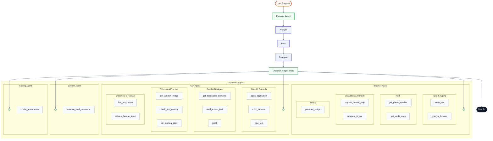

# Pilot

Cross-platform AI agent system for autonomous desktop and web automation.

[](https://www.python.org/downloads/)
[](https://opensource.org/licenses/MIT)
[](https://www.crewai.com/)
[](https://browser-use.com/)

## Overview

Pilot enables AI to control your computer like a human would. Describe what you want in natural language, and the system figures out how to do it — across browsers, desktop apps, and the terminal. Uses multi-agent orchestration with specialist agents for web automation, GUI control, system commands, and code generation.

## Quick Start

Get running in 3 commands:

```bash
# Clone and install
git clone https://github.com/lahfir/pilot.git && cd pilot
curl -LsSf https://astral.sh/uv/install.sh | sh
uv sync --extra macos  # or windows/linux

# Configure (create .env file)
echo "LLM_PROVIDER=google
LLM_MODEL=gemini-2.0-flash-exp
GOOGLE_API_KEY=your_key_here" > .env

# Run
uv run python -m pilot.main
```

**macOS users:** Grant accessibility permissions in System Settings → Privacy & Security → Accessibility (add Terminal to the list).

## Installation

### macOS

```bash
git clone https://github.com/lahfir/pilot.git && cd pilot
curl -LsSf https://astral.sh/uv/install.sh | sh
uv sync --extra macos
```

**Permissions:** System Settings → Privacy & Security → Accessibility → Add Terminal (or your IDE)

### Windows

```bash
git clone https://github.com/lahfir/pilot.git && cd pilot
powershell -c "irm https://astral.sh/uv/install.ps1 | iex"
uv sync --extra windows
```

**Permissions:** Run terminal as Administrator for full UI Automation access

### Linux

```bash
git clone https://github.com/lahfir/pilot.git && cd pilot
curl -LsSf https://astral.sh/uv/install.sh | sh
sudo apt-get install -y python3-pyatspi python3-xlib
uv sync --extra linux
```

**Note:** Requires X11 (Wayland support is limited)

### One-shot Installer

```bash
git clone https://github.com/lahfir/pilot.git && cd pilot
./install.sh
```

The installer detects your platform, installs dependencies, and configures permissions.

## CLI Reference

### Command

```bash
uv run python -m pilot.main [OPTIONS]
```

### Options

| Flag                      | Description                                                                      |
| ------------------------- | -------------------------------------------------------------------------------- |
| `-v`, `--verbose`         | Enable detailed logging output                                                   |
| `-q`, `--quiet`           | Minimal output, no dashboard (useful for scripts)                               |
| `--voice-input`           | Start with voice input mode enabled (toggle with F5)                             |
| `--use-browser-profile`   | Use existing Chrome user profile for authenticated sessions                      |
| `--browser-profile NAME` | Chrome profile directory name (default: "Default", requires `--use-browser-profile`) |

**Note:** `--verbose` and `--quiet` are mutually exclusive.

### Usage Examples

```bash
# Basic usage
uv run python -m pilot.main

# With voice input enabled
uv run python -m pilot.main --voice-input

# Verbose mode for debugging
uv run python -m pilot.main --verbose

# Quiet mode (minimal output)
uv run python -m pilot.main --quiet

# Use Chrome profile for authenticated sessions
uv run python -m pilot.main --use-browser-profile --browser-profile "Profile 1"
```

## Commands & Shortcuts

### Keyboard Shortcuts

| Key                      | Action                                          |
| ------------------------ | ----------------------------------------------- |
| **F5**                   | Toggle between voice and text input modes      |
| **ESC**                  | Cancel current task immediately                 |
| **Ctrl+C**               | Quit the application                            |
| **Ctrl+J** / **Alt+Enter** | Insert newline in text input (multiline tasks) |

### Interactive Commands

While in the interactive prompt, you can use:

| Command              | Aliases          | Action                                    |
| -------------------- | ---------------- | ----------------------------------------- |
| `quit`               | `exit`, `q`      | Exit the application                      |
| `history`            | `h`, `recent`    | Show last 10 tasks for quick re-selection |

## Example Session

Here's what a typical session looks like:

```bash
$ uv run python -m pilot.main

══════════════════════════════════════════════════════════════════
  Computer Use Agent
══════════════════════════════════════════════════════════════════
  Platform: macOS (ARM64) │ LLM: gemini-2.0-flash-exp
  Voice: disabled │ Twilio: not configured
══════════════════════════════════════════════════════════════════

What would you like me to do?
➤ Open Calculator and compute 25 × 36

┌─ Manager Agent ──────────────────────────────── ● ACTIVE ─┐
  ┊ Analyzing task: Need to open Calculator app and perform calculation
  → Delegating to GUI Agent: Open Calculator and compute 25 × 36
└─ Manager Agent ───────────────────────── COMPLETE ─┘

┌─ GUI Agent ──────────────────────────────── ● ACTIVE ─┐
  • Opening Calculator application
  ⟳ open_application
      → app_name: Calculator
  ✓ open_application (0.85s)
      ← Application opened successfully
  • Typing calculation: 25 * 36 =
  ⟳ type_text
      → text: 25 * 36 =
  ✓ type_text (0.12s)
      ← Text typed successfully
└─ GUI Agent ───────────────────────── COMPLETE ─┘
│ Duration: 2s │ Tools: 2/2              │

✅ Result: Calculator opened and calculation completed. Result: 900

══════════════════════════════════════════════════════════════════
  SESSION SUMMARY
══════════════════════════════════════════════════════════════════
  Duration: 3s │ Tools: 2/2 │ Tokens: 45↑ 12↓ │ Agents: 2
  Time Breakdown: LLM 1s (33%) │ Tools 1s (33%) │ Other 1s (33%) │ LLM Calls: 2
══════════════════════════════════════════════════════════════════

What would you like me to do?
➤ _
```

## Configuration

Create a `.env` file in the project root:

```bash
# Required: LLM provider and model
LLM_PROVIDER=google
LLM_MODEL=gemini-2.0-flash-exp
GOOGLE_API_KEY=your_key_here

# Vision LLM (for screenshot analysis)
VISION_LLM_PROVIDER=google
VISION_LLM_MODEL=gemini-2.0-flash-exp

# Browser LLM (for web automation)
BROWSER_LLM_PROVIDER=google
BROWSER_LLM_MODEL=gemini-2.0-flash-exp
```

### Supported LLM Providers

| Provider  | Models                           | Environment Variable |
| --------- | -------------------------------- | -------------------- |
| Google    | gemini-2.0-flash-exp, gemini-pro | `GOOGLE_API_KEY`     |
| OpenAI    | gpt-4o, gpt-4-turbo              | `OPENAI_API_KEY`     |
| Anthropic | claude-3-5-sonnet, claude-3-opus | `ANTHROPIC_API_KEY`  |

### Optional: Phone Verification (Twilio)

```bash
TWILIO_ACCOUNT_SID=your_sid
TWILIO_AUTH_TOKEN=your_token
TWILIO_PHONE_NUMBER=+1234567890
WEBHOOK_PORT=5000  # Optional, defaults to 5000
```

Enables SMS verification for account signups during web automation.

### Optional: Voice Input (Deepgram)

```bash
DEEPGRAM_API_KEY=your_deepgram_key
VOICE_INPUT_LANGUAGE=multi  # or 'en', 'es', 'fr', etc.
```

Enables voice-to-text input (100+ languages supported). Toggle with F5 key.

## Agents

The system uses a hierarchical multi-agent architecture:

| Agent       | Role                                  | Description                                                                |
| ----------- | ------------------------------------- | -------------------------------------------------------------------------- |
| **Manager** | Task Orchestration Manager            | Analyzes requests, decomposes into subtasks, delegates to specialists      |
| **Browser** | Web Automation Specialist             | Web navigation, downloads, forms, phone verification via Browser-Use       |
| **GUI**     | Desktop Application Automation Expert | Native app control with multi-tier accuracy (accessibility → OCR → vision) |
| **System**  | System Command & Terminal Expert      | Shell commands, file operations, process management                        |
| **Coding**  | Code Automation Specialist            | Code writing, refactoring, bug fixes via Cline AI                          |

## Tools

### GUI Tools

| Tool                      | Description                                        |
| ------------------------- | -------------------------------------------------- |
| `open_application`        | Launch and focus desktop applications              |
| `get_accessible_elements` | Get interactive UI elements via accessibility APIs |
| `click_element`           | Click elements using multi-tier detection          |
| `type_text`               | Keyboard input, shortcuts, and text entry          |
| `read_screen_text`        | Extract text from screen via OCR                   |
| `scroll`                  | Scroll content in applications                     |
| `get_window_image`        | Capture specific window as image                   |
| `check_app_running`       | Check if an application is running                 |
| `list_running_apps`       | List all running applications                      |
| `request_human_input`     | Escalate to human for CAPTCHAs, 2FA, or decisions  |
| `find_application`        | LLM-based app selection for a given capability     |
| `take_screenshot`         | Capture screenshots (full screen, region, or app window) |

### Web Tools (Browser Agent)

**Browser-Use Core Actions:**

| Tool              | Description                     |
| ----------------- | ------------------------------- |
| `go_to_url`       | Navigate to a URL               |
| `click_element`   | Click on page elements          |
| `input_text`      | Type text into form fields      |
| `scroll_down/up`  | Scroll the page                 |
| `extract_content` | Extract text/data from pages    |
| `upload_file`     | Upload files to web forms       |
| `screenshot`      | Capture page screenshots        |
| `wait`            | Wait for elements or conditions |

**Custom Browser Tools:**

| Tool                 | Description                                            |
| -------------------- | ------------------------------------------------------ |
| `paste_text`         | Instant text paste via JavaScript (faster than typing) |
| `type_to_focused`     | Type into canvas editors (Google Docs, Notion, Figma)  |
| `get_phone_number`   | Get Twilio number for SMS verification                 |
| `get_verify_code`    | Wait for and retrieve SMS verification code            |
| `request_human_help` | Request human help for CAPTCHAs, 2FA, QR codes         |
| `generate_image`     | Generate AI images using Gemini for ads/marketing      |
| `delegate_to_gui`    | Delegate OS-native dialogs to GUI agent                |

### System Tools

| Tool                    | Description                                  |
| ----------------------- | -------------------------------------------- |
| `execute_shell_command` | Safe shell command execution with validation |

### Coding Tools

| Tool                | Description                                       |
| ------------------- | ------------------------------------------------- |
| `coding_automation` | Autonomous code writing/modification via Cline AI |

### Observation Tools

| Tool                 | Description                                    |
| -------------------- | ---------------------------------------------- |
| `get_system_state`   | Observe current system state (OPAV pattern)    |
| `verify_app_focused` | Verify that a specific application is focused  |

## Architecture



1. **Manager Agent** receives your request and breaks it into subtasks
2. **Specialist agents** execute their portion using appropriate tools
3. **Context flows automatically** between agents (file paths, data, state)
4. **Multi-tier accuracy** ensures reliable element detection across platforms

For detailed architecture, see [docs/ARCHITECTURE_OVERVIEW.md](docs/ARCHITECTURE_OVERVIEW.md) and [docs/CREWAI_ARCHITECTURE.md](docs/CREWAI_ARCHITECTURE.md).

## Programmatic Usage

Use the `ComputerUseCrew` class for programmatic control:

```python
import asyncio
from pilot.crew import ComputerUseCrew
from pilot.utils.platform_detector import detect_platform
from pilot.utils.safety_checker import SafetyChecker

async def main():
    # Initialize crew
    crew = ComputerUseCrew(
        capabilities=detect_platform(),
        safety_checker=SafetyChecker(),
    )
    
    # Execute a task
    result = await crew.execute_task("Open Safari and search for Python tutorials")
    
    # Check result
    print(f"Success: {result.overall_success}")
    print(f"Result: {result.result}")
    if result.error:
        print(f"Error: {result.error}")

asyncio.run(main())
```

### With Conversation History

```python
conversation_history = []

# First task
result1 = await crew.execute_task(
    "Download a PDF from example.com",
    conversation_history=conversation_history
)

# Second task (can reference previous results)
result2 = await crew.execute_task(
    "Open that PDF in Preview",
    conversation_history=conversation_history
)
```

### With Browser Profile (Authenticated Sessions)

```python
crew = ComputerUseCrew(
    capabilities=detect_platform(),
    safety_checker=SafetyChecker(),
    use_browser_profile=True,
    browser_profile_directory="Profile 1",  # Chrome profile name
)
```

### TaskExecutionResult Schema

```python
class TaskExecutionResult:
    task: str                    # Original task description
    result: str | None           # Execution result text (None if failed)
    overall_success: bool        # Whether execution succeeded
    error: str | None           # Error message if failed
```

## Examples

### Browser Tasks

```text
Download HD image of Cristiano Ronaldo
Search for Tesla stock price and save to file
Sign up for account on website with phone verification
```

### Desktop GUI Tasks

```text
Open Calculator and compute 1234 × 5678
Create new document in TextEdit with content "Hello World"
Open System Settings and change theme to dark mode
```

### System Tasks

```text
Create folder named "reports" in Documents
Move all PDF files from Downloads to Documents
List all Python files in current directory
```

### Coding Tasks

```text
Create a snake game in Python using pygame
Write unit tests for the user authentication module
Refactor the database queries to use async/await
```

### Multi-step Workflows

```text
Download census data from census.gov and create chart in Excel
Research fashion trends online and create summary in TextEdit
Scrape product prices from Amazon and generate a comparison report
```

## Safety Model

### Blocked Operations

- Deleting system files or protected directories
- Formatting drives
- Operations on system folders (`/etc`, `/usr`, `C:\Windows`)

### Confirmation Required

- Any file deletion
- Commands with destructive potential (`rm`, `del`, `format`)
- Operations outside the user's home directory

### Manual Override

| Control                  | Action                                 |
| ------------------------ | -------------------------------------- |
| **ESC**                  | Cancel current task immediately        |
| **Confirmation prompts** | Approve or reject dangerous operations |
| `LOG_LEVEL=DEBUG`        | Enable verbose logging                 |

## Troubleshooting

### macOS: "Accessibility permission denied"

1. Open System Settings → Privacy & Security → Accessibility
2. Click the lock icon and authenticate
3. Click "+" and add Terminal (or your IDE)
4. Restart Terminal/IDE

### Windows: "UI Automation not available"

Run PowerShell or Terminal as Administrator (right-click → "Run as Administrator").

### Linux: "AT-SPI not available"

```bash
sudo apt-get install -y python3-pyatspi python3-xlib
```

Ensure you're running X11 (Wayland support is limited).

### OCR Not Working

The system defaults to EasyOCR. Alternative engines:

| Engine       | Platform   | Notes                  |
| ------------ | ---------- | ---------------------- |
| EasyOCR      | All        | Default, 80+ languages |
| PaddleOCR    | All        | Lighter, faster        |
| macOS Vision | macOS only | Native, high accuracy  |

### Invalid API Key

- Verify no quotes around the key value in `.env`
- Test the key in the provider's console
- Confirm correct environment variable name

### Voice Input Issues

| Issue                        | Solution                                            |
| ---------------------------- | --------------------------------------------------- |
| "DEEPGRAM_API_KEY not found" | Add `DEEPGRAM_API_KEY=...` to `.env`                |
| "No microphone detected"     | Check system permissions and hardware               |
| Language detection failing   | Set `VOICE_INPUT_LANGUAGE=multi` for auto-detection |

## Requirements

### Python

| Version | Status   |
| ------- | -------- |
| 3.11+   | Required |

### Platform Support

| Platform | Version                   | Accessibility API            | Status       |
| -------- | ------------------------- | ---------------------------- | ------------ |
| macOS    | 10.14+ (Mojave)           | NSAccessibility via atomacos | Full support |
| Windows  | 10+                       | UI Automation via pywinauto  | Full support |
| Linux    | Ubuntu 20.04+, Debian 11+ | AT-SPI via pyatspi           | Full support |

## Development

### Setup

```bash
git clone https://github.com/lahfir/pilot.git
cd pilot
uv sync --dev --extra macos  # or windows/linux
```

### Run Tests

```bash
uv run pytest
```

### Lint and Format

```bash
uv run ruff check .
uv run ruff check --fix .
uv run ruff format .
```

### Code Standards

- Maximum 400 lines per file
- Docstrings only (no inline comments)
- Type hints required
- All files must pass ruff

## Performance

| Operation               | Typical Time |
| ----------------------- | ------------ |
| Task analysis           | 1-2s         |
| Accessibility detection | <100ms       |
| OCR detection           | 200-500ms    |
| Vision AI fallback      | 1-3s         |
| Click/type execution    | <50ms        |
| Full browser workflow   | 10-30s       |

## License

MIT License

## Acknowledgements

Built on these excellent open-source projects:

- [CrewAI](https://www.crewai.com/) — Multi-agent orchestration framework
- [Browser-Use](https://browser-use.com/) — Web automation engine
- [Cline](https://github.com/cline/cline) — Autonomous AI coding agent
- [LangChain](https://www.langchain.com/) — LLM integration framework
- [EasyOCR](https://github.com/JaidedAI/EasyOCR) — OCR with 80+ language support
- [OpenCV](https://opencv.org/) — Computer vision
- [PyAutoGUI](https://github.com/asweigart/pyautogui) — Cross-platform input control
- [atomacos](https://github.com/daveenguyen/atomacos) (macOS), [pywinauto](https://github.com/pywinauto/pywinauto) (Windows), [pyatspi](https://gitlab.gnome.org/GNOME/pyatspi2) (Linux) — Platform accessibility APIs
- [Deepgram](https://deepgram.com/) — Voice-to-text transcription
- [Twilio](https://www.twilio.com/) — SMS verification
