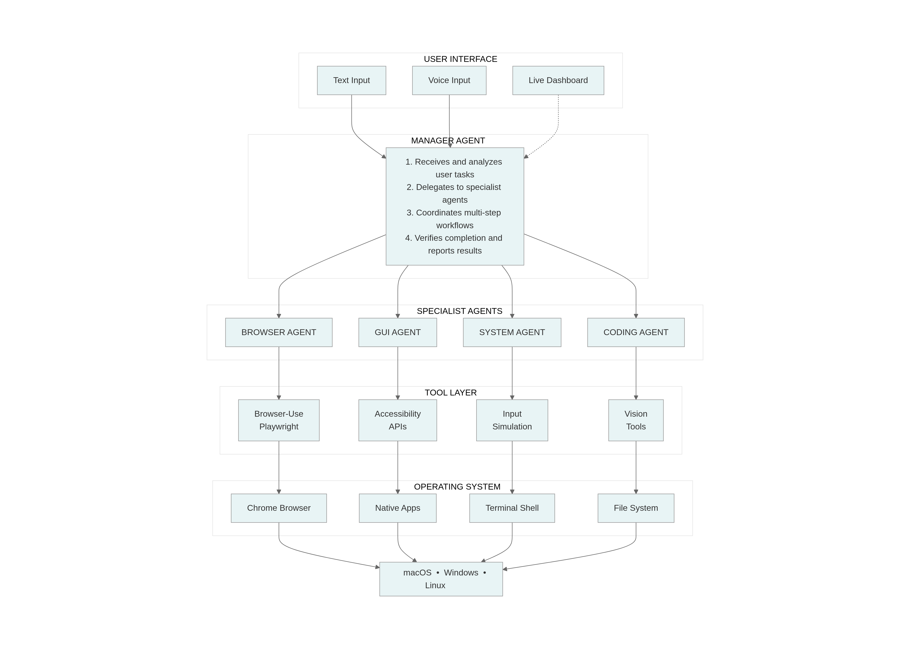

# Multi-Agent Desktop Automation - Architecture Overview

## Executive Summary

This document provides a comprehensive overview of the pilot automation system's architecture. The system enables AI agents to control desktop applications, web browsers, and system operations autonomously - essentially allowing AI to "use a computer" like a human would.

---

## System Architecture Diagram

### How Components Work Together

1. **User submits a task** via text or voice input
2. **Manager Agent analyzes** the request and determines which specialists are needed
3. **Specialist Agents execute** their portion using appropriate tools
4. **Tools interact** with the operating system through safe, accessibility-based methods
5. **Results flow back** through the chain to the user with status updates

---

## A) Operating System & Environment

### Supported Platforms

The system is designed to work across all major desktop operating systems:

| Platform    | Support Level | Requirements                                           |
| ----------- | ------------- | ------------------------------------------------------ |
| **macOS**   | Full Support  | macOS 10.15 (Catalina) or newer                        |
| **Windows** | Full Support  | Windows 10 or Windows 11                               |
| **Linux**   | Full Support  | Any modern distribution (Ubuntu, Fedora, Debian, etc.) |

### Deployment Model

**Current Setup: Single Machine Operation**

All agents run on a single computer as part of one coordinated system. The architecture uses a "team of specialists" model:

- A **Manager Agent** receives tasks and delegates to specialists
- **Specialist Agents** (Browser, Desktop GUI, System, Coding) execute their portion
- All agents share the same machine, user account, and resources

**Future Scaling Options:**

For multi-machine or cloud deployments, the system could be extended to run across:

- Multiple cloud virtual machines (VMs)
- Containerized environments (Docker, Kubernetes)
- Distributed across physical machines

This would require additional orchestration infrastructure not currently built-in.

---

## B) Desktop & Browser Control

### How the System Controls the Computer

The system uses the same accessibility features that enable screen readers and assistive technologies for people with disabilities. This is a legitimate, well-supported method that operating systems provide for automation.

#### Desktop Application Control

**What makes this work:**

1. **Accessibility APIs** - The operating system provides a structured view of every button, text field, menu, and interactive element on screen. The agent reads this "map" to understand what's available and where to click.

2. **Input Simulation** - When the agent needs to click, type, or scroll, it sends commands that the operating system treats as if a real mouse and keyboard were being used.

3. **Visual Recognition (Fallback)** - For applications that don't fully support accessibility, the system can "see" the screen using OCR (text recognition) and image analysis to find elements.

**Permission Requirements:**

| Platform | What's Needed            | How to Enable                                                  |
| -------- | ------------------------ | -------------------------------------------------------------- |
| macOS    | Accessibility permission | System Settings → Privacy & Security → Accessibility           |
| Windows  | Standard user account    | Usually works automatically; admin may be needed for some apps |
| Linux    | Accessibility service    | Enabled in system accessibility settings                       |

No special administrator privileges or system modifications are required. The agent runs with normal user permissions.

#### What Applications Can Be Controlled

**Fully Supported:**

- All standard desktop applications (word processors, spreadsheets, email clients, etc.)
- Web browsers (Chrome, Firefox, Safari, Edge)
- File managers and system utilities
- Development tools and IDEs
- Communication apps (Slack, Teams, Discord)

**Partially Supported (may require visual fallback):**

- Games and entertainment software
- Custom-built enterprise applications
- Applications with non-standard interfaces or not able to be accessed via accessibility APIs

**Not Supported:**

- Password managers and security vaults (blocked for security)
- System-level dialogs requiring admin authentication
- Applications running in elevated/administrator mode (when agent runs as standard user)

#### Browser Automation

For web-based tasks, the system uses a specialized browser automation framework:

**Capabilities:**

- Navigate to websites and fill forms
- Click buttons, links, and interactive elements
- Handle multi-step workflows (login → navigate → complete task)
- Download files and capture information
- Work with complex web applications (Google Docs, Office 365, etc.)

**Session Management:**

- Can use your existing Chrome profile (with saved logins and cookies)
- Or create fresh, isolated browser sessions for each task
- Browser sessions can be reused across related tasks for efficiency

---

## C) Agent Isolation

### How Agents Are Currently Separated

Understanding how agents are isolated is important for security, reliability, and multi-user scenarios.

| Aspect                          | Current State      | Explanation                                              |
| ------------------------------- | ------------------ | -------------------------------------------------------- |
| **Operating System Users**      | Shared             | All agents run under the same user account               |
| **Computer Processes**          | Shared             | All agents run within one program                        |
| **Browser Sessions**            | Configurable       | Can share a profile or use isolated sessions             |
| **File Storage**                | Partially Separate | Each task gets its own temporary workspace for downloads |
| **Containers/Virtual Machines** | Not Used           | Would need external tools to implement                   |

### What This Means in Practice

**Current Model (Single User, Single Machine):**

- Fast communication between agents
- Shared access to all user's files and applications
- One task runs at a time
- If one agent fails, it may affect others

**For Multi-User or Enterprise Deployments:**

If multiple users or truly isolated agents are needed, additional infrastructure would be required:

1. **Separate User Accounts** - Each agent runs as a different OS user
2. **Virtual Machines** - Each agent gets its own isolated computer environment
3. **Containers** - Lightweight isolation using Docker or similar technology
4. **Cloud Instances** - Each agent runs on a separate cloud server

These options would require custom integration work beyond the current system.

---

## D) Resource Usage

### System Requirements Per Agent

| Resource         | Typical Usage      | Notes                                             |
| ---------------- | ------------------ | ------------------------------------------------- |
| **Memory (RAM)** | 300-800 MB         | Varies based on active tools; browser adds ~500MB |
| **CPU**          | 20-80% of one core | Spikes during AI processing and screen analysis   |
| **Disk Space**   | Minimal            | Temporary files cleaned after tasks               |
| **Network**      | Moderate           | AI API calls and browser traffic                  |

### Performance Characteristics

**What's Fast:**

- Clicking buttons and typing text (under 200ms)
- Reading cached element information (instant)
- Simple file operations

**What Takes Time:**

- AI decision-making (1-5 seconds per decision, depends on AI provider)
- Scanning complex application interfaces (1-3 seconds)
- Reading text from screen images (1-2 seconds)
- Starting new browser sessions (2-3 seconds, faster when reusing sessions)

### Primary Performance Factors

1. **AI Response Time** - The biggest factor; depends on which AI model is used and API latency
2. **Application Complexity** - Apps with many interface elements take longer to analyze
3. **Screen Resolution** - Higher resolution means more data to process
4. **Network Speed** - Affects AI API calls and web automation

---

## E) Reliability & Control

### How the System Handles Problems

#### Automatic Retry Mechanisms

When something doesn't work the first time, the system has built-in retry logic, it is highly configurable:

| Agent Type        | Maximum Attempts                               | Purpose                          |
| ----------------- | ---------------------------------------------- | -------------------------------- |
| Browser Agent     | 2 task attempts, up to 10 consecutive failures | Handles temporary web issues     |
| Desktop GUI Agent | 25 iterations                                  | Complex multi-step desktop tasks |
| System Agent      | 10 iterations                                  | Shell command execution          |
| Coding Agent      | 3 attempts                                     | Code writing and modification    |

Each iteration allows the agent to observe, adjust, and try a different approach.

#### Detecting Stuck or Failed Tasks

**Current Capabilities:**

| Detection Method              | How It Works                                                   |
| ----------------------------- | -------------------------------------------------------------- |
| **Iteration Limits**          | Agents stop after reaching maximum attempts                    |
| **Failure Counting**          | Browser tasks ask for human help after 10 consecutive failures |
| **Human Assistance Requests** | Agents can pause and ask the user for help when stuck          |
| **User Cancellation**         | Pressing ESC key immediately stops the current task            |
| **Error Handling**            | Errors are caught and reported rather than crashing            |

#### Human Assistance Requests

When agents encounter situations they cannot handle autonomously, they can request human help:

**When Human Help is Requested:**

- **CAPTCHAs and Security Challenges** - Visual puzzles that require human verification
- **Two-Factor Authentication** - When login codes are sent to phones or email
- **Ambiguous Instructions** - When the agent needs clarification on what to do
- **Complex Decision Points** - Situations requiring human judgment
- **Repeated Failures** - After multiple unsuccessful attempts at the same action
- **Native OS Dialogs** - System dialogs that browsers cannot interact with (file pickers, print dialogs)

**How It Works:**

1. The agent pauses execution and displays a prompt to the user
2. The user can provide input, guidance, or complete the action manually
3. Once resolved, the agent continues with the task
4. Users can also choose to skip, retry with different approach, or cancel

**Response Options Available:**

| Option            | Description                                                       |
| ----------------- | ----------------------------------------------------------------- |
| **Provide Input** | Type information the agent needs (codes, answers, clarifications) |
| **Retry**         | Ask the agent to try again with a different approach              |
| **Skip**          | Continue past this step if it's not critical                      |
| **Cancel**        | Stop the entire task                                              |

This human-in-the-loop capability ensures that tasks don't fail completely when encountering edge cases that require human judgment or intervention.

**What Happens When Something Goes Wrong:**

1. The agent attempts to recover using alternative approaches
2. If recovery fails, the task is marked as failed with an error message
3. The system returns to ready state for the next task
4. No data is lost; partial results are preserved when possible

#### Manual Override

Users maintain control at all times:

- **ESC Key** - Immediately cancels any running task
- **Confirmation Prompts** - Dangerous operations (like deleting files or updating system files) require approval
- **Verbose Mode** - See detailed logs of every action for debugging

#### Safety Measures

The system includes protection against accidental damage:

**Blocked Operations:**

- Deleting system files or protected directories
- Formatting drives
- Operations on system folders (/etc, /usr, C:\Windows, etc.)

**Confirmation Required:**

- Any file deletion
- Commands with destructive potential (rm, del, format)
- Operations outside the user's home directory

### Areas for Future Enhancement

The following reliability features are not currently implemented but could be added:

| Feature                 | Description                                | Benefit                           |
| ----------------------- | ------------------------------------------ | --------------------------------- |
| **Task Timeouts**       | Automatic cancellation after a time limit  | Prevents indefinitely stuck tasks |
| **Health Monitoring**   | Periodic checks that agents are responsive | Early detection of problems       |
| **Auto-Restart**        | Automatically restart failed components    | Self-healing capability           |
| **Process Supervision** | External monitoring of the entire system   | Enterprise-grade reliability      |

---
